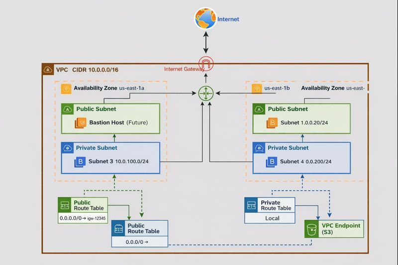
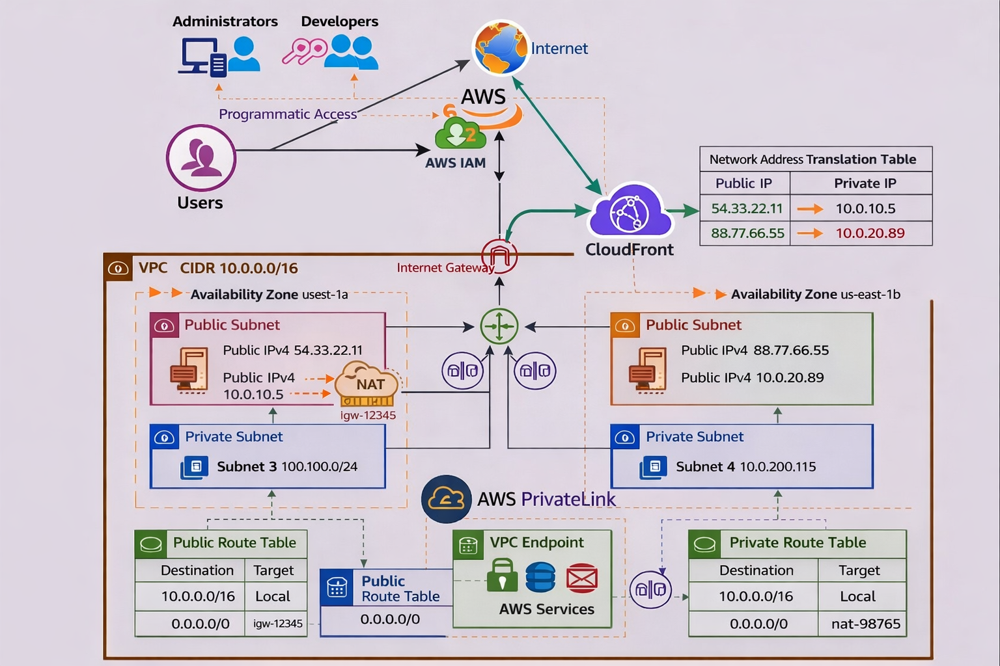

# AWS VPC Web Application Architecture

## 📌 Project Overview
This project demonstrates the design and implementation of a secure, scalable,
and highly available AWS VPC architecture for hosting a multi-tier web application.

The architecture is designed following AWS best practices with a focus on:
- Network segmentation
- Layer 4 security controls
- IAM-based access management
- High availability across multiple Availability Zones

🚧 **This project is a work in progress and will be continuously enhanced to
include additional AWS services and production-grade features.**

---

## 🏗 Architecture Diagrams

### 🔹 Initial Network Architecture
This diagram represents the initial VPC networking foundation, including
subnet design, routing, and internet access.

---

### 🔹 Extended Architecture (In Progress)
This diagram extends the initial design by adding compute resources and IAM-based
access control for users and applications.

> Both diagrams are intentionally preserved to demonstrate the architectural
> evolution of the project.

---

## 📋 Current Scope
- VPC (10.0.0.0/16)
- 2 Public Subnets (Multi-AZ)
- 2 Private Subnets (Multi-AZ)
- Internet Gateway
- Route Tables
- S3 VPC Endpoint
- IAM Users and Groups
- IAM Roles for EC2
- EBS-backed EC2 instances (Multi-AZ)

---

## ☁️ AWS Services Used
- Amazon VPC
- Subnets
- Route Tables
- Internet Gateway
- VPC Endpoint (S3)
- Amazon EC2
- IAM (Users, Groups, Roles, Policies)

---

## 🔐 Security & Access Control Design

### 🔹 Network-Level Security (Layer 4)
- Network ACLs control inbound and outbound traffic at the subnet level.
- Public subnets allow only required ports (HTTP/HTTPS).
- Private subnets accept traffic only from trusted internal sources.
- Direct internet access to private subnets is restricted.

### 🔹 Instance-Level Security (Layer 4)
- Security Groups act as instance-level firewalls.
- Access is restricted following the principle of least privilege.
- Administrative access is limited to authorized users only.

---

## 👥 IAM & Programmatic Access Design

### 🔹 IAM Users and Groups
- IAM Users are created for **Administrators** and **Developers**.
- Users are organized into IAM Groups:
  - **Admins Group**: Administrative permissions.
  - **Developers Group**: Limited permissions based on job responsibilities.
- Programmatic access is enabled for interaction with AWS services using:
  - AWS CLI
  - AWS SDKs
  - Automation tools

---

### 🔹 IAM Roles for EC2 Instances
- EC2 instances are assigned an IAM Role to securely access AWS services.
- The role provides controlled access to services such as:
  - Amazon S3
  - Amazon CloudWatch
- No AWS credentials are stored in application code or configuration files.
- Applications retrieve temporary credentials via the Instance Metadata Service (IMDS).

---

## 📚 What I Learned
- Designing multi-AZ VPC architectures
- Applying Layer 4 security using NACLs and Security Groups
- Implementing IAM-based access control
- Using IAM Roles for secure application access to AWS services
- Building secure and scalable cloud foundations

---

## 🚀 Planned Enhancements
- Application Load Balancer (ALB)
- Auto Scaling Group (ASG)
- Bastion Host
- Monitoring and logging with CloudWatch
- CI/CD pipeline integration
- Infrastructure as Code (Terraform / CloudFormation)

---

## 🎯 Design Philosophy
This project aligns with the AWS Well-Architected Framework, emphasizing:
- Security
- Reliability
- Scalability
- Operational Excellence

