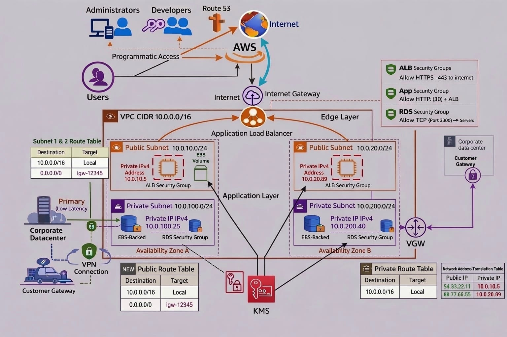

# Enterprise-Grade AWS Multi-Tier Web Architecture

---

## 📌 Project Overview

This project demonstrates the design and implementation of a **secure, scalable, and highly available multi-tier web application architecture on AWS**.

The solution follows AWS best practices and the AWS Well-Architected Framework, focusing on:

* High Availability (Multi-AZ deployment)
* Layer 4 Security Controls (Security Groups)
* IAM-based secure access (Users, Roles, Programmatic access)
* DNS management and routing
* Data encryption at rest using KMS

---

## 🏗 Architecture Overview

The application is deployed inside a custom **Amazon VPC (10.0.0.0/16)** with a multi-tier design:

### 🔹 Subnet Design

| Subnet Type      | CIDR           | AZ   |
| ---------------- | -------------- | ---- |
| Public Subnet 1  | 10.0.10.0/24   | AZ-A |
| Public Subnet 2  | 10.0.20.0/24   | AZ-B |
| Private Subnet 1 | 10.0.100.0/24  | AZ-A |
| Private Subnet 2 | 10.0.200.0/24  | AZ-B |

---

## 🌐 Traffic Flow (End-to-End)

1. Users access the application via domain name.
2. DNS is managed using **Amazon Route 53**.
3. Requests pass through the **Internet Gateway (igw-12345)**.
4. Traffic is forwarded to an **Application Load Balancer (ALB)**.
5. ALB distributes requests across EC2 instances in public subnets.
6. Application communicates with **Amazon RDS** in private subnets.
7. **KMS** encrypts data at rest for RDS and EBS volumes.

---

## ☁️ AWS Services Used

* Amazon VPC (10.0.0.0/16)
* Subnets (Public & Private)
* Internet Gateway (igw-12345)
* Amazon EC2 (EBS-backed instances)
* Application Load Balancer (ALB)
* Amazon RDS (Multi-AZ)
* Amazon Route 53
* AWS IAM
* AWS KMS
* Virtual Private Gateway (VGW)

---

## 🔐 Security & Access Control Design

### 🔹 Instance Level (Security Groups)

* **ALB Security Group:**
  * Allow inbound HTTPS (443) from internet
* **App Security Group:**
  * Allow inbound HTTP (80) from ALB only
* **RDS Security Group:**
  * Allow inbound TCP (Port 3306) from App Servers only

---

## 🖥 Compute Layer

* Two Amazon EC2 instances (one per AZ)
* EBS-backed storage — encrypted via KMS
* Deployed in **public subnets** behind ALB
  * Public Subnet 1: `10.0.10.5`
  * Public Subnet 2: `10.0.20.89`

---

## 👥 IAM & Programmatic Access

* AWS IAM used for:
  * **Administrators** → Full access
  * **Developers** → Limited/programmatic access
* Programmatic access via AWS CLI & SDKs

---

## 🗄 Database Layer

* Amazon RDS deployed in **private subnets** (Multi-AZ)
  * Private Subnet 1: `10.0.100.25`
  * Private Subnet 2: `10.0.200.40`
* No direct internet access
* Automatic failover in case of primary failure

---

## 🔐 Data Encryption

* RDS encryption enabled via **AWS KMS**
* EBS volumes encrypted via **AWS KMS**
* Data encrypted at rest

---

## 🌍 DNS & Routing

* **Amazon Route 53** manages DNS
* Routes traffic to Internet Gateway → ALB

---

## 🔗 Hybrid Connectivity

* **Virtual Private Gateway (VGW)** connects VPC to Corporate Datacenter
* **VPN Connection** for secure site-to-site communication
* **Customer Gateway** on the corporate side
* Network Address Translation Table:

| Public IP     | Private IP   |
| ------------- | ------------ |
| 54.33.22.11   | 10.0.10.5    |
| 88.77.66.55   | 10.0.20.89   |

---

## 🔀 Route Tables

### Public Route Table (Subnets 1 & 2)

| Destination  | Target    |
| ------------ | --------- |
| 10.0.0.0/16  | Local     |
| 0.0.0.0/0    | igw-12345 |

### Private Route Table (Subnets 3 & 4)

| Destination  | Target |
| ------------ | ------ |
| 10.0.0.0/16  | Local  |

---

## 📈 High Availability & Scalability

* Multi-AZ deployment across AZ-A and AZ-B
* ALB distributes traffic across both AZs
* Fault-tolerant RDS with automatic failover

---

## 🏗 Final Architecture Diagram

> This architecture was designed to simulate a real-world production environment on AWS.

---

## 📚 What I Learned

* Designing production-grade AWS architectures
* Implementing secure multi-tier environments
* Applying IAM best practices
* Building highly available systems
* Hybrid cloud connectivity using VGW and VPN

---

## 🎯 Design Philosophy

Aligned with AWS Well-Architected Framework:

* Security
* Reliability
* Performance Efficiency
* Cost Optimization
* Operational Excellence
