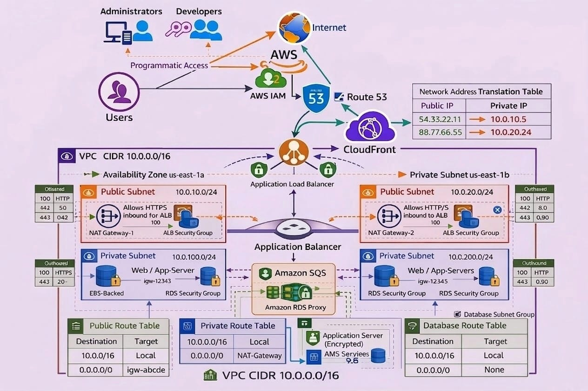

#  Enterprise-Grade AWS Multi-Tier Web Architecture

---

## 📌 Project Overview

This project demonstrates the design and implementation of a **secure, scalable, and highly available multi-tier web application architecture on AWS**.

The solution follows AWS best practices and the AWS Well-Architected Framework, focusing on:

* High Availability (Multi-AZ deployment)
* Layer 4 Security Controls (NACLs & Security Groups)
* IAM-based secure access (Users, Roles, Programmatic access)
* Global performance optimization
* Decoupled architecture for scalability
* Data encryption at rest

---

## 🏗 Architecture Overview

The application is deployed inside a custom **Amazon VPC (10.0.0.0/16)** with a multi-tier design:

### 🔹 Subnet Design

| Subnet Type      | CIDR          | AZ   |
| ---------------- | ------------- | ---- |
| Public Subnet 1  | 10.0.10.0/24  | AZ-1 |
| Public Subnet 2  | 10.0.20.0/24  | AZ-2 |
| Private Subnet 1 | 10.0.100.0/24 | AZ-1 |
| Private Subnet 2 | 10.0.200.0/24 | AZ-2 |

---

## 🌐 Traffic Flow (End-to-End)

1. Users access the application via domain name.
2. DNS is managed using Amazon Route 53.
3. Requests are routed to Amazon CloudFront for global edge delivery.
4. Traffic is forwarded to an Application Load Balancer.
5. ALB distributes requests across EC2 instances in private subnets.
6. Application communicates asynchronously via Amazon SQS.
7. Backend data is stored in Amazon RDS (Multi-AZ).

---

## ☁️ AWS Services Used

* Amazon VPC
* Subnets (Public & Private)
* Internet Gateway & NAT Gateways
* Amazon EC2 (EBS-backed instances)
* Application Load Balancer
* Amazon RDS (Multi-AZ)
* Amazon SQS
* Amazon CloudFront
* Amazon Route 53
* AWS IAM
* VPC Endpoints (S3)

---

## 🔐 Security & Access Control Design

### 🔹 Layer 4 Security

#### Subnet Level (NACLs)

* Public subnets allow only:

  * HTTP (80)
  * HTTPS (443)
* Private subnets:

  * Accept traffic only from ALB
  * Deny direct internet access

#### Instance Level (Security Groups)

* ALB Security Group:

  * Allow inbound 80/443 from internet
* EC2 Security Group:

  * Allow inbound only from ALB
* RDS Security Group:

  * Allow inbound only from application servers

---

## 🖥 Compute Layer

* Two Amazon EC2 instances:

  * One in each AZ
* EBS-backed storage
* Deployed in private subnets (no direct public access)

---

## 👥 IAM & Programmatic Access

* AWS IAM is used for:

  * Admins → Full access
  * Developers → Limited access
* Programmatic access via:

  * AWS CLI
  * SDKs

### 🔹 EC2 IAM Roles

* Secure access to:

  * S3
  * CloudWatch
* No hardcoded credentials

---

## 🌍 Global Performance Optimization

* Amazon CloudFront:

  * Caches content at edge locations
* Amazon Route 53:

  * Latency-based routing
  * Health checks

---

## 🗄 Database Layer

* Amazon RDS deployed in **Multi-AZ**
* Automatic failover in case of primary failure
* Database Subnet Group (private subnets only)

---

## 🔐 Data Encryption

* RDS encryption enabled (KMS)
* EBS volumes encrypted
* Data encrypted at rest

---

## 🔄 Decoupling Layer

* Amazon SQS is used to:

  * Decouple application tier from database
  * Handle traffic spikes
  * Improve reliability

---

## 📈 High Availability & Scalability

* Multi-AZ deployment
* Load Balancer distributes traffic
* Fault tolerance across AZs
* (Planned) Auto Scaling Group

---

## 🏗 Final Architecture Diagram

This diagram represents the complete production-ready architecture of the system,
including networking, compute, security, database, and global performance components.

The design follows AWS best practices for:

* High Availability (Multi-AZ)
* Security (Layer 4 controls using NACLs & Security Groups)
* Scalability and decoupling using SQS
* Global content delivery using CloudFront
* Fault-tolerant database with RDS Multi-AZ

> This architecture was designed to simulate a real-world production environment on AWS.

---

## 🚀 Future Enhancements

* Auto Scaling Group (ASG)
* Bastion Host
* CI/CD Pipeline
* Monitoring with CloudWatch & Alarms
* Infrastructure as Code (Terraform / CloudFormation)

---

## 📚 What I Learned

* Designing production-grade AWS architectures
* Implementing secure multi-tier environments
* Applying IAM best practices
* Building highly available systems
* Decoupling applications using queues

---

## 🎯 Design Philosophy

Aligned with AWS Well-Architected Framework:

* Security
* Reliability
* Performance Efficiency
* Cost Optimization
* Operational Excellence

